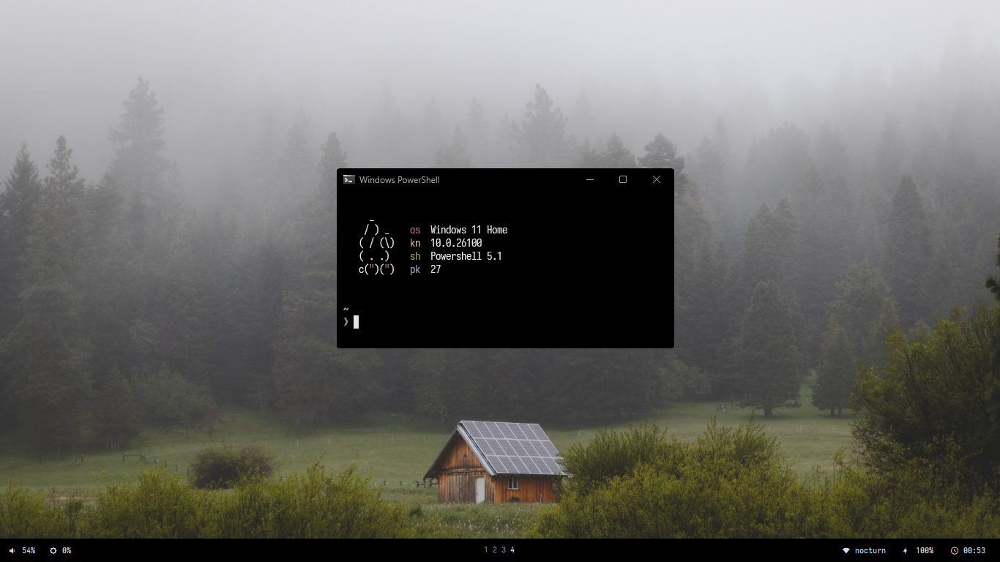

<div align="center">
    
</div>
<h2 align="center"> Bunnyfetch </h2>

<p align="center">
    This is my personal fork of Elenapan's bunnyfetch.
    Hope you like it
</p>

<br>

### Setup

1. **Dependencies**

    There's not much dependencies, you only need Powershell and Winget (which is installed by default on Windows), and Git!
    Everything will be installed through the Installation step.

    + Powershell
    + Winget
    + [Git]()

    <br>

2. **Installation**

    Open your terminal (AS ADMINISTRATOR!), and copy these commands (one by one)

    ```powershell
    Winget install Git.Git
    ```

    ```powershell
    git clone https://github.com/ahmadinne/bunnyfetch
    ```

    ```powershell
    cd bunnyfetch; .\install.ps1
    ```

    <br>

